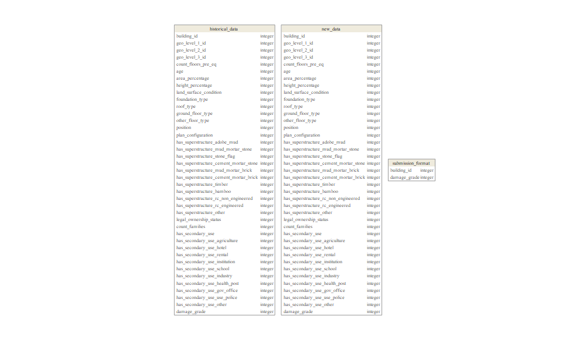

# `modeling.earthquake.damage` 

<!-- badges: start -->

[](https://travis-ci.org/data-science-competitions/modeling.earthquake.damage)
[](https://codecov.io/github/data-science-competitions/modeling.earthquake.damage/?branch=master)
[](https://mybinder.org/v2/gh/data-science-competitions/modeling.earthquake.damage/master?urlpath=rstudio)
<!-- badges: end -->

<!-- Package Title -->

Richter’s Predictor: Modeling Earthquake
Damage

-----


<!-- Package Description -->

## Description

Predict the level of damage to buildings that were hit by the Gorkha
earthquake.

## Installation

`modeling.earthquake.damage` accommodates two stages in the project
life-cycle: Development and Production.

### Working in Pseudo-Package Mode (Advised During Development Stage)

1.  Download the project to local computer
2.  Launch the project via `modeling.earthquake.damage.Rproj`
3.  Optional: Install all package
dependencies

<!-- end list -->

``` r
remotes::install_local(dependencies = TRUE, force = TRUE, upgrade = "always")
devtools::uninstall()
```

4.  Load the complete project as a package via `devtools::load_all()` or
    Ctrl+Shift+L

### Working in Package Mode (Advised During Production Stage)

    install.packages("devtools")
    devtools::install_github("data-science-competitions/modeling.earthquake.damage")

## Datasets

### Accessing the Project Data

``` r
ds <- DataStore$new()
names(ds$data_model)
```

    ## [1] "historical_data"   "new_data"          "submission_format"

### Data Overview

<font size="2.5">

    ## -- Table source -----------------------------------------------------------------------------------------------
    ## src:  <PrepareData>
    ## -- Data model -------------------------------------------------------------------------------------------------
    ## Data model object:
    ##   3 tables:  historical_data, new_data, submission_format 
    ##   82 columns
    ##   2 primary keys
    ##   1 references
    ## -- Rows -------------------------------------------------------------------------------------------------------
    ## Total: 434337
    ## historical_data: 260601, new_data: 86868, submission_format: 86868

</font>



### Data Glimpse

    ## ---
    ## historical_data

    ## Observations: 260,601
    ## Variables: 40
    ## $ building_id                            <chr> "802906", "28830", "94947", "590882", "201944", ...
    ## $ geo_level_1_id                         <int> 6, 8, 21, 22, 11, 8, 9, 20, 0, 26, 17, 17, 12, 1...
    ## $ geo_level_2_id                         <int> 487, 900, 363, 418, 131, 558, 475, 323, 757, 886...
    ## $ geo_level_3_id                         <int> 12198, 2812, 8973, 10694, 1488, 6089, 12066, 122...
    ## $ count_floors_pre_eq                    <int> 2, 2, 2, 2, 3, 2, 2, 2, 2, 1, 2, 1, 2, 3, 2, 2, ...
    ## $ age                                    <int> 30, 10, 10, 10, 30, 10, 25, 0, 15, 0, 20, 10, 15...
    ## $ area_percentage                        <int> 6, 8, 5, 6, 8, 9, 3, 8, 8, 13, 9, 8, 6, 7, 7, 4,...
    ## $ height_percentage                      <int> 5, 7, 5, 5, 9, 5, 4, 6, 6, 4, 6, 4, 5, 7, 6, 4, ...
    ## $ land_surface_condition                 <fct> t, o, t, t, t, t, n, t, t, t, t, t, t, t, t, n, ...
    ## $ foundation_type                        <fct> r, r, r, r, r, r, r, w, r, i, r, u, r, r, r, r, ...
    ## $ roof_type                              <fct> n, n, n, n, n, n, n, q, q, n, q, n, n, q, n, n, ...
    ## $ ground_floor_type                      <fct> f, x, f, f, f, f, x, v, f, v, f, v, x, f, f, f, ...
    ## $ other_floor_type                       <fct> q, q, x, x, x, q, q, x, q, j, q, j, x, q, x, q, ...
    ## $ position                               <fct> t, s, t, s, s, s, s, s, s, s, t, t, s, s, s, s, ...
    ## $ plan_configuration                     <fct> d, d, d, d, d, d, d, u, d, d, d, d, d, d, d, d, ...
    ## $ has_superstructure_adobe_mud           <lgl> TRUE, FALSE, FALSE, FALSE, TRUE, FALSE, FALSE, F...
    ## $ has_superstructure_mud_mortar_stone    <lgl> TRUE, TRUE, TRUE, TRUE, FALSE, TRUE, TRUE, FALSE...
    ## $ has_superstructure_stone_flag          <lgl> FALSE, FALSE, FALSE, FALSE, FALSE, FALSE, FALSE,...
    ## $ has_superstructure_cement_mortar_stone <lgl> FALSE, FALSE, FALSE, FALSE, FALSE, FALSE, FALSE,...
    ## $ has_superstructure_mud_mortar_brick    <lgl> FALSE, FALSE, FALSE, FALSE, FALSE, FALSE, FALSE,...
    ## $ has_superstructure_cement_mortar_brick <lgl> FALSE, FALSE, FALSE, FALSE, FALSE, FALSE, FALSE,...
    ## $ has_superstructure_timber              <lgl> FALSE, FALSE, FALSE, TRUE, FALSE, FALSE, FALSE, ...
    ## $ has_superstructure_bamboo              <lgl> FALSE, FALSE, FALSE, TRUE, FALSE, FALSE, FALSE, ...
    ## $ has_superstructure_rc_non_engineered   <lgl> FALSE, FALSE, FALSE, FALSE, FALSE, FALSE, FALSE,...
    ## $ has_superstructure_rc_engineered       <lgl> FALSE, FALSE, FALSE, FALSE, FALSE, FALSE, FALSE,...
    ## $ has_superstructure_other               <lgl> FALSE, FALSE, FALSE, FALSE, FALSE, FALSE, FALSE,...
    ## $ legal_ownership_status                 <fct> v, v, v, v, v, v, v, v, v, v, v, a, v, v, v, v, ...
    ## $ count_families                         <int> 1, 1, 1, 1, 1, 1, 1, 1, 1, 1, 1, 1, 1, 1, 1, 1, ...
    ## $ has_secondary_use                      <lgl> FALSE, FALSE, FALSE, FALSE, FALSE, TRUE, FALSE, ...
    ## $ has_secondary_use_agriculture          <lgl> FALSE, FALSE, FALSE, FALSE, FALSE, TRUE, FALSE, ...
    ## $ has_secondary_use_hotel                <lgl> FALSE, FALSE, FALSE, FALSE, FALSE, FALSE, FALSE,...
    ## $ has_secondary_use_rental               <lgl> FALSE, FALSE, FALSE, FALSE, FALSE, FALSE, FALSE,...
    ## $ has_secondary_use_institution          <lgl> FALSE, FALSE, FALSE, FALSE, FALSE, FALSE, FALSE,...
    ## $ has_secondary_use_school               <lgl> FALSE, FALSE, FALSE, FALSE, FALSE, FALSE, FALSE,...
    ## $ has_secondary_use_industry             <lgl> FALSE, FALSE, FALSE, FALSE, FALSE, FALSE, FALSE,...
    ## $ has_secondary_use_health_post          <lgl> FALSE, FALSE, FALSE, FALSE, FALSE, FALSE, FALSE,...
    ## $ has_secondary_use_gov_office           <lgl> FALSE, FALSE, FALSE, FALSE, FALSE, FALSE, FALSE,...
    ## $ has_secondary_use_use_police           <lgl> FALSE, FALSE, FALSE, FALSE, FALSE, FALSE, FALSE,...
    ## $ has_secondary_use_other                <lgl> FALSE, FALSE, FALSE, FALSE, FALSE, FALSE, FALSE,...
    ## $ damage_grade                           <dbl> 3, 2, 3, 2, 3, 2, 3, 1, 2, 1, 3, 2, 2, 3, 3, 2, ...

<!--
## Function Dependencies


-->
